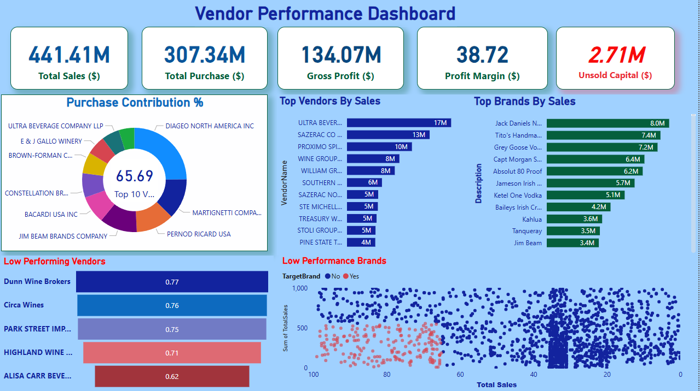

# Vendor-Performance-Data-Analytics-End-to-End-Project

Final Recommendations
● Re-evaluate pricing for low-sales, high-margin brands to boost sales volume without sacrificing profitability.
● Diversify vendor partnerships to reduce dependency on a few suppliers and mitigate supply chain risks.
● Leverage bulk purchasing advantages to maintain competitive pricing while optimizing inventory management.
● Optimize slow-moving inventory by adjusting purchase quantities, launching clearance sales, or revising storage strategies.
● Enhance marketing and distribution strategies for low-performing vendors to drive higher sales volumes without compromising profit margins.
● By implementing these recommendations, the company can achieve sustainable profitability, mitigate risks, and enhance overall operational efficiency.
